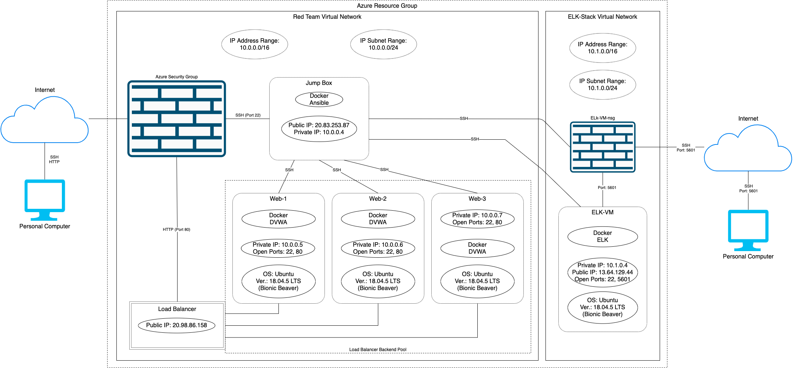
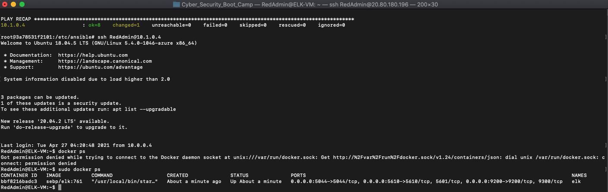
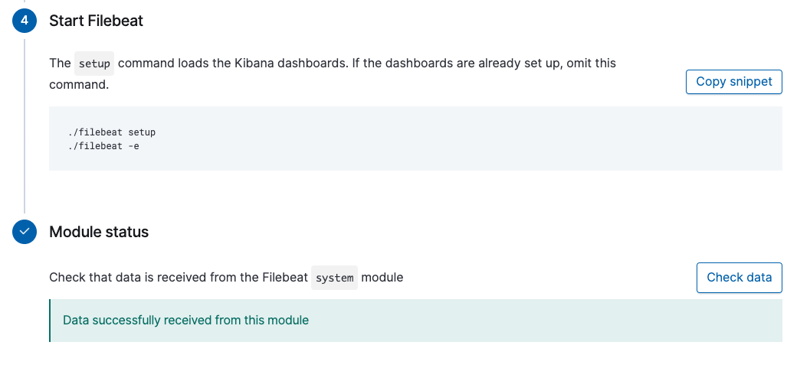
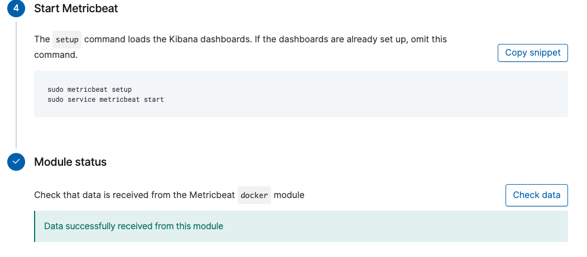

## Automated ELK Stack Deployment

The files in this repository were used to configure the network depicted below.

These files have been tested and used to generate a live ELK deployment on Azure. They can be used to either recreate the entire deployment pictured above. Alternatively, select portions of the Ansible file may be used to install only certain pieces of it, such as Filebeat.

This document contains the following details:
- Description of the Topology
- Access Policies
- ELK Configuration
  - Beats in Use
  - Machines Being Monitored
- How to Use the Ansible Build

### Description of the Topology

The main purpose of this network is to expose a load-balanced and monitored instance of DVWA, the D\*mn Vulnerable Web Application.

Load balancing ensures that the application will be highly redundant, in addition to restricting access to the internal network.

Integrating an ELK server allows users to easily monitor the vulnerable VMs for changes to the state of files (Filebeat) and system-level monitoring (Metricbeat).

The configuration details of each machine may be found below.

| Name (VM's) | Function  | IP Address (Private) | IP Address (Public) | Operating System                   |
|-------------|-----------|----------------------|---------------------|------------------------------------|
| Jump Box    | Gateway   | 10.0.0.4             | 22.83.253.87        | Ubuntu 18.04.5 LTS (Bionic Beaver) |
| Web-1       | DVWA      | 10.0.0.5             |                     | Ubuntu 18.04.5 LTS (Bionic Beaver) |
| Web-2       | DVWA      | 10.0.0.6             |                     | Ubuntu 18.04.5 LTS (Bionic Beaver) |
| Web-3       | DVWA      | 10.0.0.7             |                     | Ubuntu 18.04.5 LTS (Bionic Beaver) |
| ELK-VM      | ELK Stack | 10.1.0.4             | 13.64.129.44        | Ubuntu 18.04.5 LTS (Bionic Beaver) |

### Access Policies

The machines on the internal network are not exposed to the public Internet. 

Only the Jump Box machine can accept connections from the Internet (via SSH). Access to this machine is only allowed from the following IP addresses:
- _107.194.225.15 (my personal IP address)_

Machines within the network can only be accessed by the Jump Box.

A summary of the access policies in place can be found in the table below.

| Name     | Publicly Accessible (SSH) | Allowed IP Addresses |
|----------|---------------------------|----------------------|
| Jump Box | Yes                       | 107.194.225.15       |
| Web-1    | No                        | 10.0.0.4             |
| Web-2    | No                        | 10.0.0.4             |
| Web-3    | No                        | 10.0.0.4             |
| ELK-VM   | No                        | 10.0.0.4             |

### Elk Configuration

Ansible was used to automate configuration of the ELK machine. No configuration was performed manually, which is advantageous because this allows the manager of the system to set up as many ELK stacks as desired at a moments notice. This is also nice since if the ELK machine dies for whatever reason another can quickly be set up.

The playbook implements the following tasks:

- _Install Docker.io (the docker engine)_
- _Install python3_
- _Install Docker module_
- _Increase virtual memory_
- _Use more memory_
- _Download and launch a docker ELK container_
- _Enable service docker on boot_

The following screenshot displays the result of running `docker ps` after successfully configuring the ELK instance.

### Target Machines & Beats
This ELK server is configured to monitor the following machines:

- _10.0.0.5_
- _10.0.0.6_
- _10.0.0.7_

We have installed the following Beats on these machines:
- _Metricbeat_

- _Filebeat_

These Beats allow us to collect the following information from each machine:
- _'Metricbeat': Collects system-level data. This includes information like CPU usage, memory, disk IO, ect. Metricbeats would be able to tell if the servers were getting overloaded or turned off._
- _'Filebeat': Collects file-level data. File beats collects snapshots of each file and monitors when files have been altered._

### Using the Playbook
In order to use the playbook, you will need to have an Ansible control node already configured. Assuming you have such a control node provisioned: 

SSH into the control node and follow the steps below:
- Copy the contencts of _Ansible/_ and _Linux/_ files to */etc/ansible/*.
- Update the hosts file to include the DVWA webservers and the ELK stack VM. Or simply use the hosts file included in *Ansible/hosts*.
- Run the playbook, and navigate to 13.64.129.44:5601 to check that the installation worked as expected.

As a Bonus, provide the specific commands the user will need to run to download the playbook, update the files, etc.

- ssh RedAdmin@22.83.253.87
> _Now inside Jumpbox_
- sudo docker start elastic_hertz
- sudo docker attach elastic_hertz
> _Now inside Ansible Control Node Container_
- cd /etc/ansible/
> _Download all the files with git and organize in a different order_
- git clone git@github.com:SweetishSean/UCLA_Cyber_Sec_Project_1.git
- cd UCLA_Cyber_Sec_Project_1/
- mv Ansible/* .
- mv Linux/* .
> _Run all the playbooks_
- anisble-playbook create_dvwa.yml
- ansible-playbook create_elk.yml
- ansible-playbook filebeat-playbook.yml 
- ansible-playbook metricbeat-playbook.yml
> _Done_
